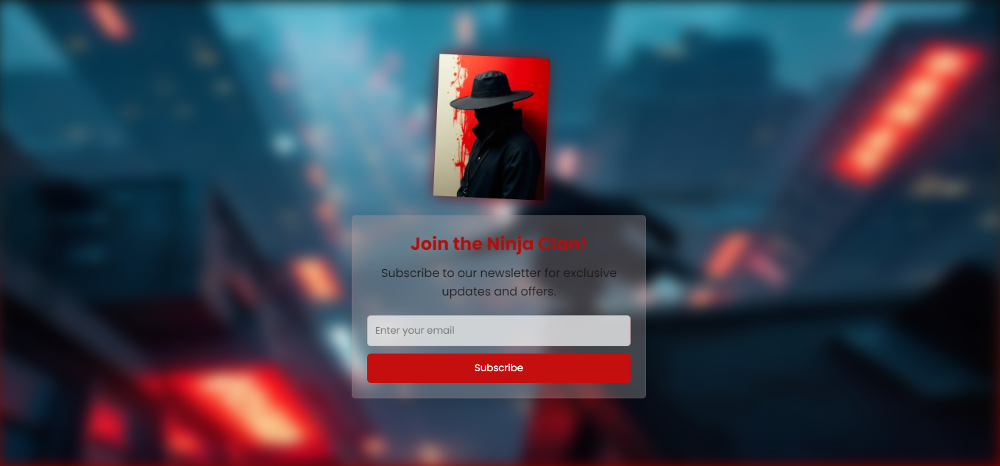

# Ninja Subscribe Landing Page

Welcome to the Ninja Subscribe Landing Page! This project showcases a modern and visually appealing landing page design with a unique ninja Image animation.

## Design Concept

The design concept for this landing page is to create an engaging and immersive experience for users. The dark color scheme, combined with the ninja animation and the subtle background elements, aims to capture the attention of the visitors and encourage them to subscribe to the newsletter.

The key design elements include:

- **Ninja Image Animation**: The ninja character is the focal point of the page, with a flip animation that reveals a welcoming message when hovered over.
- **Dark Color Palette**: The use of a dark color palette, including shades of black, gray, and a touch of blood red, creates a moody and mysterious atmosphere.
- **Responsive Design**: The landing page is designed to be responsive, ensuring a seamless experience across various devices and screen sizes.
- **Smooth Transitions**: The page features smooth transitions and animations, such as the subscription button hover effect, to enhance the overall user experience.

## Screenshot and Video

Here's a screenshot of the landing page:



And a screen-recorded video showcasing the interactive features:


## Live URL: 
[ahmedbernawi](https://github.com/ahmedbernawi)

## Source Code

The source code for the landing page, including the `flipper` container animation, is provided below:

```html 
<div class="flip-container">
    <div class="flipper">
        
        <div class="back">
            <div class="welcome-text">It is our great pleasure to have you on board! A hearty welcome to you!</div>
        </div>
    </div>
</div>
```
```css
.flip-container {
    perspective: 1000px; 
    margin: 20px auto; 
}

.flipper {
    position: relative;
    width: 200px; 
    height: 200px; 
    transition: transform 0.6s;
    transform-style: preserve-3d; 
}

.front, .back {
    position: absolute;
    top: 0;
    left: 0;
    backface-visibility: hidden; 
}

.back {
    transform: rotateY(180deg);
    display: flex;
    align-items: center;
    justify-content: center;
    background: rgba(255, 255, 255, 0.8);
    padding: 20px;
    border-radius: 5px;
    box-shadow: 0 5px 15px rgba(255, 0, 0, 0.5);
    color: #333;
}

.ninja-character:hover .flipper {
 
   transform: rotateY(180deg); 
}
```

##Author [ahmedbernawi](https://github.com/ahmedbernawi)
The code is written by me, a beginner in web development. I'm still learning and experimenting.
